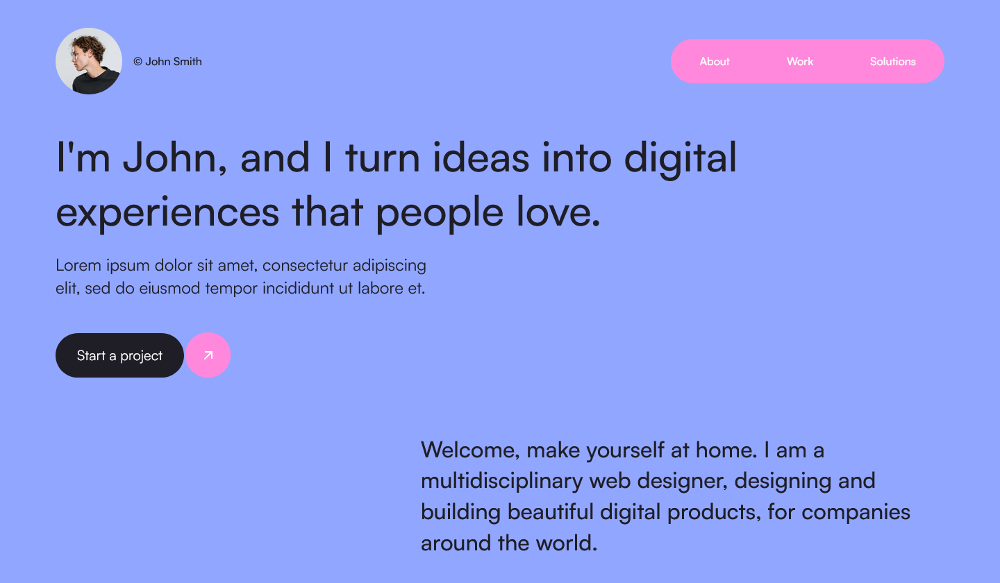

# Designer/Dev Portfolio



A responsive demo designer/developer portfolio featuring a mosaic layout for projects. Created with vanilla CSS and the React framework Next.js.

Adapted from a Figma design by [Florin Pop](https://www.florin-pop.com/).

## Built with

- Next.js 13
- CSS
- HTML

## What I've learned

### Palette generator

- **Problem**:
  I wanted to add some colour to the originally black-and-white design to make it more visually interesting. However, tweaking colours to find a fitting palette can be time-consuming.

- **Solution**: [coolors](https://coolors.co/) is a useful tool I found for making pretty colour palettes quickly. Simply lock-in any colours you want and let it generate the rest for you.

### Masonry layout

- **Problem**: Design included a masonry layout, a term that I had just recently discovered. What I've also discovered is that it can be a bit tough to create from scratch.
  - There exists a [native implementation](https://developer.mozilla.org/en-US/docs/Web/CSS/CSS_grid_layout/Masonry_layout) but currently has almost no [browser support](https://caniuse.com/?search=masonry).
  - It is easy to create a ['fake' masonry layout](https://css-irl.info/masonry-in-css/) in CSS using columns, but the items are ordered by column, not by row. For this site, it would have undesired behaviour when reducing the screen size and so I did not choose this option.
- **Solution**: Initially, I reached out for the popular [Masonry JavaScript library](https://masonry.desandro.com/) by David DeSandro, which has been around since 2010.

- **Problem**: Project was migrated over to Next.js and the Masonry library needed to be replaced. I needed to search for a React masonry layout library but most did not meet the needs of this project (e.g., responsiveness, being able to set number of columns).
- **Solution**: [react-responsive-masonry](https://www.npmjs.com/package/react-responsive-masonry) by Cédric Delpoux works well for what I had in mind and is very easy to use.

- **Problem**: Using react-responsive-masonry, the items in each column were not centred correctly.
  - I set up a new test environment to set up a minimal working solution and got it working exactly as I wanted. But when I tried moving the same solution over to the website the same issue popped up again. I tried switching off all styles that could be affecting it in the browser's developer tools but the issue persisted. I could not quickly figure out what the cause was.
- **Solution**: The columns for the masonry layout are flexboxes, so I could patch-fix this by targetting them with a pretty specific CSS selector (the HTML was not directly accessible) and manually centring their items:
  ```css
  .cardsContainer > div > div > div {
    align-items: center;
  }
  ```
  It works but there's probably a cleaner solution.

### Next.js 13 setup and configuration

The reason I switched over two Next.js was two-fold.

1. I needed to render a dynamic collection of project item cards based on the category filter chosen (all/design/development). I knew this would be simple in a components-based library, such as React which I'm already familiar with.
2. Since I planned on using React, I figured it would be good practise to set up Next.js as I had been wanting to try it out again. Getting comfortable with it now would help me with my next planned project where I will need functinality such as routing, which is relatively easy to handle in Next.js.

- **Problem**: Although I had set up a simple Next.js project in the past, Next.js 13 was new to me. I was aware this latest version was quite a bit different to previous ones too.
- **Solution**: The official documentation has a good [guide for getting started](https://nextjs.org/docs/getting-started/installation). Running `npx create-next-app@latest` and modifying some of the code to be compatible was enough.

- **Problem**: Relative static file imports that looked confusing (what if the file structure changes?) and lengthy
- **Solution**: Set up a [module path alias](https://nextjs.org/docs/app/building-your-application/configuring/absolute-imports-and-module-aliases) for the `/public` directory by modifying the `jsconfig.json` file.

  ```json
  "compilerOptions": {
      "paths": {
          "@/*": ["./src/*"],
          "@public/*": ["./public/*"]
      }
  }
  ```

  Then I could use the alias in import statments.

  ```javascript
  // before
  import avatarImg from ../../public/avatar.png

  // after
  import avatarImg from @public/avatar.png
  ```
